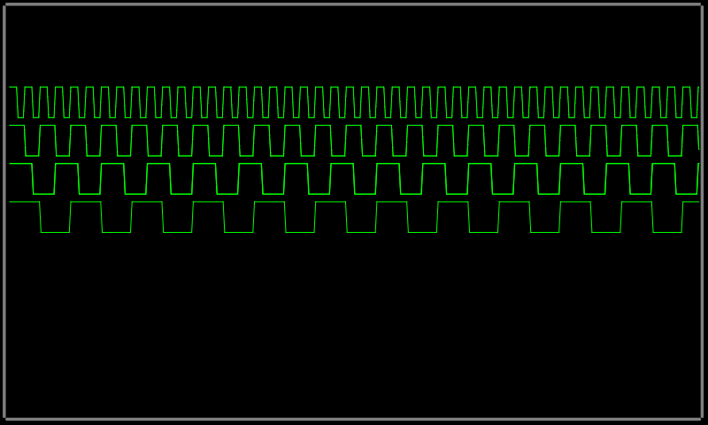

# Modular Portable Graphics Library. Sandbox

This repository contains experimental code and some examples:
 * Native drawing to PPM
   
 * STM32F407/3.5" SPI ILI9488
   Produce image like in native example, but clipped to 480x320 screen size. Use `light` GNAT RTL.
